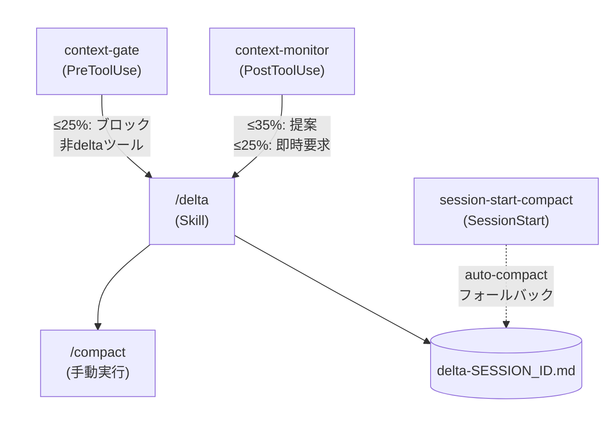

[English](README.md) | **日本語**

# delta

Claude Codeプラグイン。コンテキストウィンドウのcompaction前にDelta（計画と実装の差分）を生成し、セッション間で失われるコンテキストを保存します。

## 課題

Claude Codeで長いセッションを続けていると、コンテキストウィンドウが埋まってauto-compactが発動する。このとき、SOW/Specに書かれていない発見・設計変更・判断が失われる。

```text
セッション開始 → 調査 → 実装 → 発見・判断が蓄積 → auto-compact → 全部消える
```

deltaはこの「消える」直前に、計画との差分を記録するプラグインです。

## Delta とは

Deltaは計画（SOW/Spec）と実際の実装の間に生じた差分を記録するファイルです。

- **Discoveries** - 実装中に発見した問題や制約
- **Design Changes** - SOW/Specからの変更とその理由
- **Decisions** - 計画に記録されていない、議論中に下した判断
- **Pending** - 未完了のタスクと次のアクション

## 仕組み



1. **context-gate**（PreToolUse hook）がCRITICALレベルで非deltaツール呼び出しをブロック
   - 残量25%以下: Skill, Read, Write, Glob, Grepのみ許可（`/delta` に必要なツール）
   - その他のツールはDelta生成まで全てブロック
2. **context-monitor**（PostToolUse hook）がブリッジファイル経由でコンテキスト残量を監視
   - **WARNING**（残量35% 以下）: `/delta` の実行を提案
   - **CRITICAL**（残量25% 以下）: `/delta` の即時実行を要求
   - 重要度レベルごとに1回発火。WARNING→CRITICALへのエスカレーション時に再発火
3. **`/delta` スキル**が現在のセッションコンテキストからDeltaファイルを生成
4. **session-start-compact**（SessionStart hook）がauto-compactを検知し、トランスクリプトからDeltaを自動生成するフォールバック

## インストール

```bash
claude plugin add thkt/delta
```

## プラグイン構成

```text
.claude-plugin/
  plugin.json          # プラグインメタデータ（名前、バージョン、説明）
  marketplace.json     # プラグインレジストリ登録
hooks/
  hooks.json           # hook 登録（PreToolUse + PostToolUse + SessionStart）
  context-gate.sh      # コンテキストウィンドウ gate（critical時に非deltaツールをブロック）
  context-monitor.sh   # コンテキストウィンドウ残量監視（警告通知）
  lib/
    bridge-parser.sh   # 共有ブリッジファイル解析・閾値定義
  session-start-compact.sh  # auto-compact フォールバック Delta 生成
skills/
  delta/
    SKILL.md           # /delta スキル定義
tests/
  test-helpers.sh      # テストユーティリティ（assert_eq, assert_contains 等）
  test-context-gate.sh         # 22 アサーション
  test-context-monitor.sh      # 17 アサーション
  test-session-start-compact.sh  # 12 アサーション
```

## 設定

### 閾値

共有閾値は `hooks/lib/bridge-parser.sh` で定義され、context-gateとcontext-monitorの両方で使用されます。

| 変数                 | デフォルト | 説明                                 |
| -------------------- | ---------- | ------------------------------------ |
| `WARNING_THRESHOLD`  | 35         | 警告を出す残量 %                     |
| `CRITICAL_THRESHOLD` | 25         | 緊急警告・ツールブロックを出す残量 % |
| `STALE_SECONDS`      | 60         | ブリッジファイルの有効期限（秒）     |

デバウンス設定は `hooks/context-monitor.sh` にあります。

| 変数             | デフォルト | 説明                                              |
| ---------------- | ---------- | ------------------------------------------------- |
| `DEBOUNCE_CALLS` | 5          | チェック間にスキップする PostToolUse 呼び出し回数 |

### ブリッジファイル

context-monitorは `$TMPDIR/claude-ctx-{session_id}.json` を読み取ります。このファイルはstatusline hook（本プラグインには含まれません）が書き込みます。

```json
{ "remaining_pct": 42, "ts": 1710000000 }
```

## 依存関係

- **zsh** - hookスクリプトがzshを使用
- **jq** - context-gateとcontext-monitorはprintf代替あり（jq任意）。session-start-compactは必須

## テスト実行

```bash
bash tests/test-context-gate.sh
bash tests/test-context-monitor.sh
bash tests/test-session-start-compact.sh
```

## ライセンス

MIT
