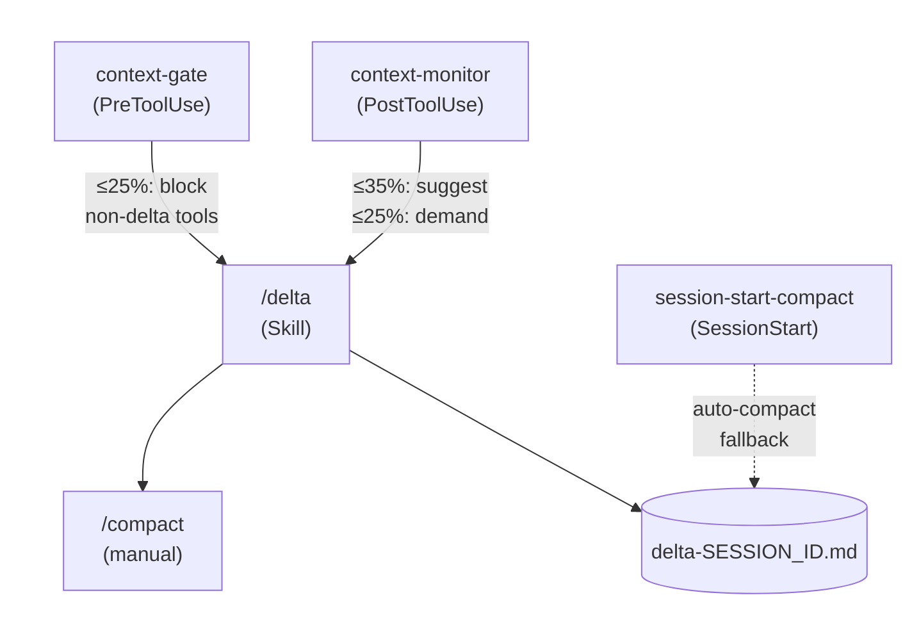

**English** | [日本語](README.ja.md)

# delta

Claude Code plugin for pre-compact Delta generation. Captures session context (discoveries, design changes, decisions, pending work) before context window compaction so nothing is lost between sessions.

## What is a Delta?

A Delta records the diff between your plan (SOW/Spec) and what actually happened during implementation:

- **Discoveries** - problems or constraints found during implementation
- **Design Changes** - deviations from SOW/Spec with rationale
- **Decisions** - choices made during discussion not recorded in plan
- **Pending** - incomplete tasks and next actions

## How it works



1. **context-gate** (PreToolUse hook) blocks non-delta tool calls at CRITICAL level
   - At ≤25% remaining: only allows Skill, Read, Write, Glob, Grep (tools needed for `/delta`)
   - All other tools are blocked until Delta is written
2. **context-monitor** (PostToolUse hook) watches context window usage via bridge file
   - **WARNING** at ≤35% remaining: suggests running `/delta`
   - **CRITICAL** at ≤25% remaining: demands immediate `/delta` execution
   - Fires once per severity level; escalation from WARNING to CRITICAL re-triggers
3. **`/delta` skill** generates a Delta file from current session context
4. **session-start-compact** (SessionStart hook) catches auto-compact events and generates Delta from the transcript as a fallback

## Installation

```bash
claude plugin add thkt/delta
```

## Plugin structure

```text
.claude-plugin/
  plugin.json          # Plugin metadata (name, version, description)
  marketplace.json     # Plugin registry listing
hooks/
  hooks.json           # Hook registrations (PreToolUse + PostToolUse + SessionStart)
  context-gate.sh      # Context window gate (blocks non-delta tools at critical)
  context-monitor.sh   # Context window usage monitor (advisory warnings)
  lib/
    bridge-parser.sh   # Shared bridge file parsing and thresholds
  session-start-compact.sh  # Auto-compact fallback Delta generator
skills/
  delta/
    SKILL.md           # /delta skill definition
tests/
  test-helpers.sh      # Test utilities (assert_eq, assert_contains, etc.)
  test-context-gate.sh         # 22 assertions
  test-context-monitor.sh      # 17 assertions
  test-session-start-compact.sh  # 12 assertions
```

## Configuration

### Thresholds

Shared thresholds are defined in `hooks/lib/bridge-parser.sh` and used by both context-gate and context-monitor:

| Variable             | Default | Description                             |
| -------------------- | ------- | --------------------------------------- |
| `WARNING_THRESHOLD`  | 35      | Remaining % to trigger warning          |
| `CRITICAL_THRESHOLD` | 25      | Remaining % to trigger critical / block |
| `STALE_SECONDS`      | 60      | Max age of bridge file data             |

The debounce setting is in `hooks/context-monitor.sh`:

| Variable         | Default | Description                              |
| ---------------- | ------- | ---------------------------------------- |
| `DEBOUNCE_CALLS` | 5       | PostToolUse calls to skip between checks |

### Bridge file

The context monitor reads from `$TMPDIR/claude-ctx-{session_id}.json`, written by a statusline hook (not included in this plugin). Expected format:

```json
{ "remaining_pct": 42, "ts": 1710000000 }
```

## Dependencies

- **zsh** - hook scripts use zsh
- **jq** - optional for context-gate and context-monitor (printf fallback without jq); required for session-start-compact

## Running tests

```bash
bash tests/test-context-gate.sh
bash tests/test-context-monitor.sh
bash tests/test-session-start-compact.sh
```

## License

MIT
